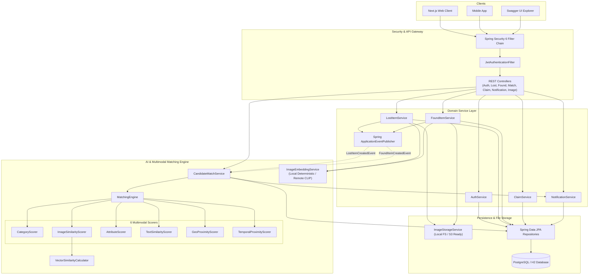
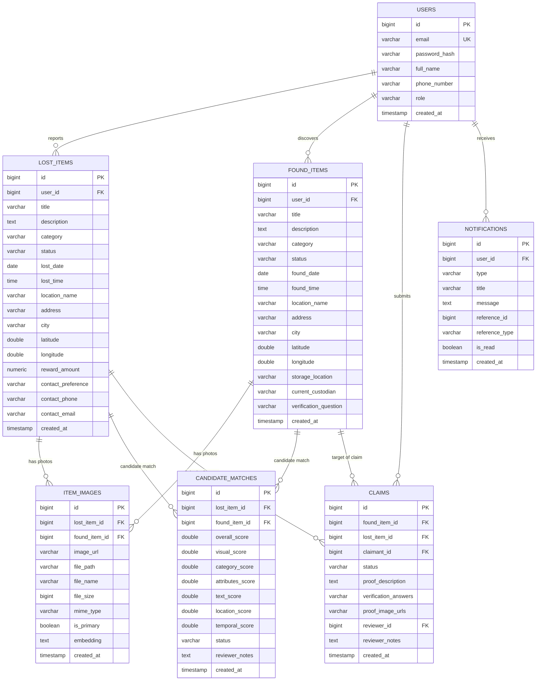
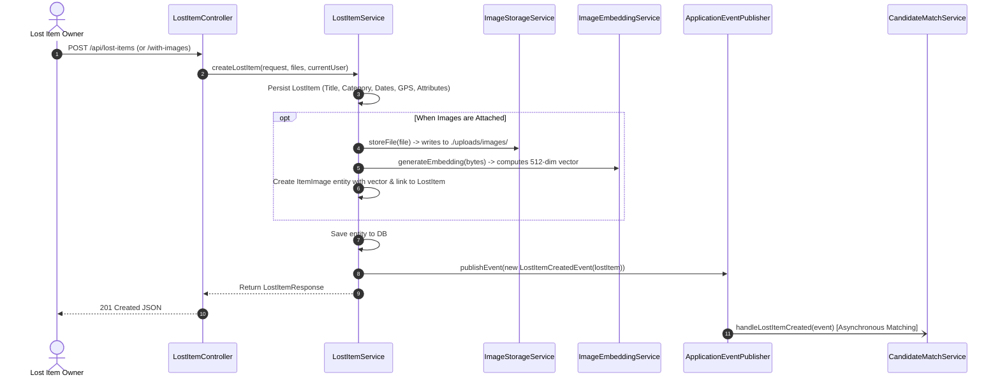
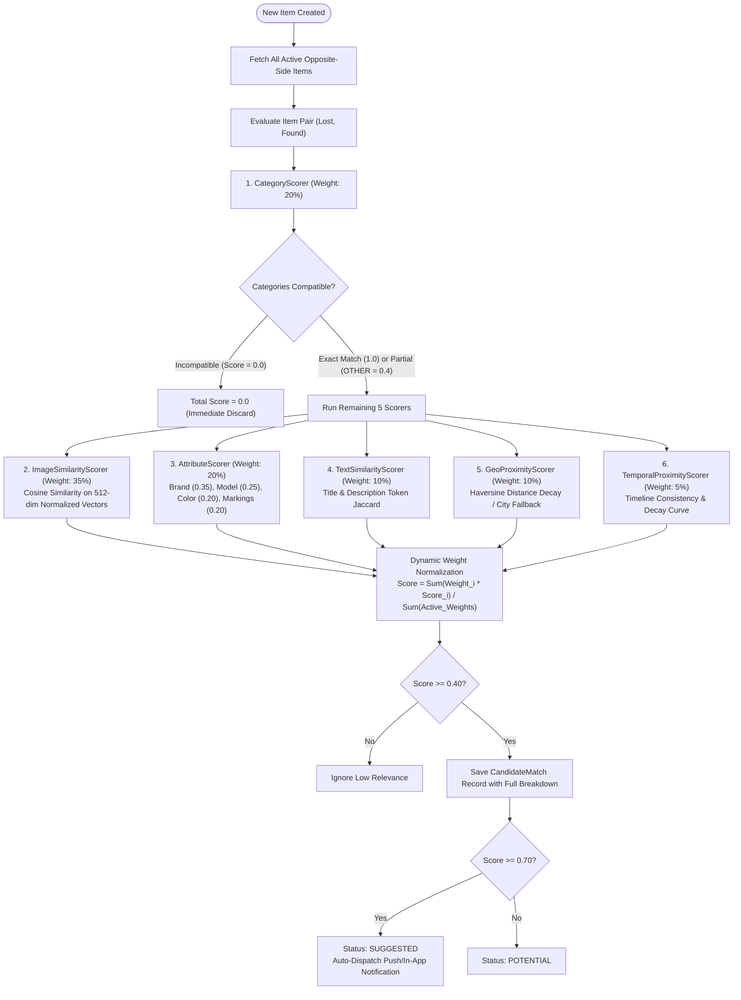
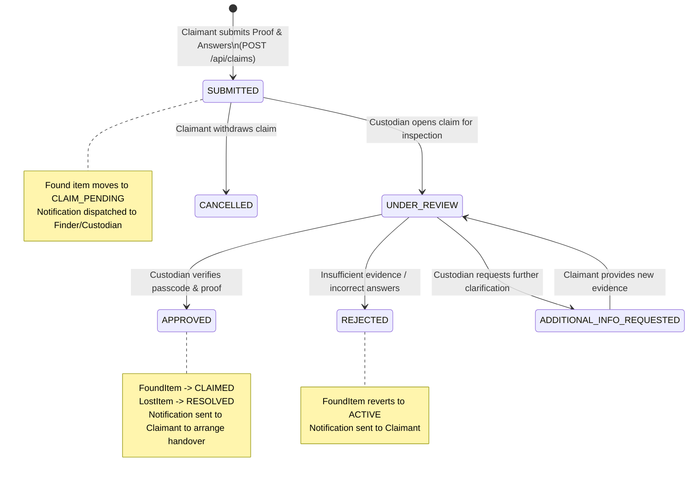

# Lost & Found Platform — Complete System Workflow & Architecture Guide

**Project Version**: `1.0.0-SNAPSHOT`  
**Platform**: Java 21 / Spring Boot 3.3.4  
**Persistence**: PostgreSQL (Production) / In-Memory H2 (Dev & Test)  
**Security**: Stateless JWT / Spring Security 6  
**Documentation**: SpringDoc OpenAPI 3.0 / Swagger UI  

---

## 1. Executive Summary & System Purpose

The **Lost & Found (L&F) Platform** is a full-featured backend application built to solve the core challenges of item recovery across campuses, airports, transit systems, and communities. Traditional lost-and-found systems suffer from:
* Incomplete or vague user descriptions.
* Low-resolution, occluded, or missing photos.
* Fragmented custodial records with no cryptographic or verifiable ownership proof.

This platform solves these problems using:
1. **Multimodal AI & Heuristic Matching Engine**: Evaluates item candidates across **6 independent dimensions** (visual embeddings, categories, fine-grained attributes, text descriptions, geographical distance, and chronological alignment).
2. **Dynamic Weight Rebalancing**: Automatically recalculates weights when images or coordinates are absent, preventing arbitrary score disqualification.
3. **Custodial Verification Workflow**: Implements a strict state machine with verification questions, proof images, and approval handovers.
4. **Event-Driven Architecture**: Uses Spring internal application events to decouple item submission from matching calculations.

---

## 2. High-Level System Architecture

The backend follows a layered architectural design with event-driven coupling:



---

## 3. Database Schema & Domain Entity Relationships (ERD)

The relational schema implements clean normalization, foreign key constraints, cascading rules, and index optimization:



---

## 4. End-to-End Operational Workflows

### 4.1 Authentication & Stateless JWT Lifecycle
1. **User Registration** (`POST /api/auth/register`):
   - Accepts email, password, full name, phone number.
   - Enforces unique email check (case-insensitive).
   - Hashes raw password via `BCryptPasswordEncoder`.
   - Issues a signed JWT bearer token valid for 24 hours.
2. **User Login** (`POST /api/auth/login`):
   - Authenticates through Spring Security's `AuthenticationManager`.
   - Returns signed JWT containing user ID, email, and authority claims.
3. **Stateless Request Interception**:
   - `JwtAuthenticationFilter` intercepts requests.
   - Parses the `Authorization: Bearer <token>` header.
   - Validates HMAC signature via `JwtTokenProvider`.
   - Injects the authenticated `UserPrincipal` into Spring's `SecurityContextHolder`.

---

### 4.2 Lost Item Ingestion Pipeline



---

### 4.3 Found Item Ingestion Pipeline
1. Discoverer / Campus Security submits report via `POST /api/found-items`.
2. Includes item category, location coordinates, custodian name, and storage location.
3. Includes a **custodial verification question** (e.g., *"What is the lockscreen photo or secret engraving?"*).
4. Generates embeddings for uploaded images and persists records.
5. Emits `FoundItemCreatedEvent`, which triggers the matching engine against all active lost items.

---

### 4.4 The Multimodal AI & Heuristic Matching Engine

The core matching logic resides in `MatchingEngine.java` and `CandidateMatchService.java`. It computes a weighted composite similarity score from 6 specialized scorers:



#### Detailed Breakdown of the 6 Scorers:
1. **Category Scorer (`CategoryScorer.java`)**:
   - Exact match = `1.0`.
   - Either item is categorized as `OTHER` = `0.4` (graceful degradation).
   - Incompatible categories (e.g., `PETS` vs `ELECTRONICS`) = `0.0` (immediate disqualification).
2. **Visual Cosine Scorer (`ImageSimilarityScorer.java`)**:
   - Calculates pairwise cosine similarity between all images of both items.
   - Normalized result lies in $[0.0, 1.0]$.
   - Returns `null` if either item lacks valid photos, triggering weight rebalancing.
3. **Attribute Scorer (`AttributeScorer.java`)**:
   - **Brand** (weight 0.35): exact match = `1.0`, substring match = `0.70`.
   - **Model** (weight 0.25): exact match = `1.0`, substring match = `0.72`.
   - **Colors** (weight 0.20): primary-to-primary = `1.0`, cross-match with secondary color = `0.70`.
   - **Distinctive Markings & Stickers** (weight 0.20): tokenizes distinctive marks, scratches, stickers (>2 chars), computing Jaccard set intersection.
4. **Text Similarity Scorer (`TextSimilarityScorer.java`)**:
   - Merges title + description, strips punctuation, removes common English stop words (`the`, `with`, `lost`, `found`, etc.), and calculates token overlap.
5. **Geographical Proximity Scorer (`GeoProximityScorer.java`)**:
   - Uses Haversine spherical formula on GPS coordinates.
   - Distance $\le 0.5\text{ km} \implies 1.0$.
   - Distance between $0.5\text{ km}$ and $25\text{ km} \implies$ linear decay to $0.0$.
   - Fallback if GPS is absent: same city = `0.85`, different city = `0.10`.
6. **Temporal Proximity Scorer (`TemporalProximityScorer.java`)**:
   - If found item date is $> 2$ days before reported lost date $\implies 0.05$ (temporal contradiction penalty).
   - Within $[-2, +2]$ days $\implies 1.0$.
   - Within 14 days $\implies$ decay from $0.90$ to $0.54$.
   - Up to 60 days $\implies$ decay down to $0.20$.

#### Dynamic Weight Rebalancing (Handling Missing/Blurry Photos)
Standard weights: Visual `0.35`, Category `0.20`, Attributes `0.20`, Text `0.10`, Geo `0.10`, Temporal `0.05`.  
If visual embeddings are absent:
$$\text{Overall Score} = \frac{0.20 \times C + 0.20 \times A + 0.10 \times T + 0.10 \times G + 0.05 \times D}{0.65}$$
*Result*: Attributes, brand, distinctive markings, and location expand proportionally to fill 100% of scoring potential without unfair penalties.

---

### 4.5 Custodial Claim & Verification State Machine



* Implemented in `ClaimService.java`.
* **Access Control**: Only the original finder/custodian or an admin/staff user can review and approve claims.
* When approved, the found item is marked `CLAIMED` and the corresponding lost item is marked `RESOLVED`.

---

### 4.6 In-App Notifications & Read Tracking
* Handled by `NotificationService.java` and `NotificationController.java`.
* Dispatches notifications for:
  - `MATCH_FOUND`: When candidate match score $\ge 70\%$.
  - `CLAIM_SUBMITTED`: Alerting custodian of an incoming claim.
  - `CLAIM_STATUS_UPDATED`: Notifying claimant of approval or rejection.
* Supports unread badge counting (`/api/notifications/unread-count`) and mark-as-read (`PATCH /api/notifications/{id}/read`).

---

### 4.7 Multimodal LLM & AI Assistance Engine

The platform incorporates a universal, pluggable LLM layer (`AiAssistanceService.java`, `LlmClientRouter.java`) supporting **Google Gemini (gemini-1.5-flash)**, **OpenAI (gpt-4o-mini)**, **Local Ollama (llama3/llava)**, and an **offline zero-key Mock provider**:

```
[ User Photo / Unstructured Text ]
              │
              ▼
    [ AiController.java ]
              │
              ▼
 [ AiAssistanceService.java ]
              │
              ▼
   [ LlmClientRouter.java ] ──(Fallback on Error)──► [ MockLlmClient ]
   ├── GeminiLlmClient   (REST, Base64 Multimodal)
   ├── OpenAiLlmClient   (REST, Chat Completions)
   └── OllamaLlmClient   (Local HTTP)
```

1. **Multimodal Attribute Extraction** (`POST /api/ai/extract-attributes`):
   - Inspects uploaded photos directly using Vision-LLMs.
   - Extracts structured attributes: `brand`, `model`, `primaryColor`, `secondaryColor`, `distinctiveMarks`, `scratchesOrDamage`, and `stickersOrAccessories`.
   - Eliminates missing-data gaps in user reports.
2. **Natural Language Report Parser** (`POST /api/ai/parse-report`):
   - Ingests messy, natural user statements (e.g. *"Lost my navy Herschel backpack yesterday at the student gym with gym clothes and AirPods inside"*).
   - Extracts date, location, category, and attributes into structured form data.
3. **Smart Custodial Claim Verification** (`POST /api/ai/verify-claim/{claimId}`):
   - Evaluates a claimant's submitted answers against the custodian's hidden question.
   - Provides confidence score (0.0 to 1.0), verdict (`LIKELY_MATCH`, `UNLIKELY_MATCH`, `INCONCLUSIVE`), and recommended custodial action (`APPROVE`, `REJECT`, `REQUEST_MORE_INFO`).
4. **Explainable Match Reasoning** (`GET /api/ai/explain-match/{matchId}`):
   - Transforms raw composite mathematical scores (visual cosine, Jaccard, Haversine) into plain-English reasoning for platform operators and users.

---

## 5. Complete REST API Reference

All responses conform to a unified JSON response envelope:
```json
{
  "success": true,
  "message": "Operation description",
  "data": { ... },
  "timestamp": "2026-10-01T23:08:41.123Z"
}
```

| Module | Method | URI | Description | Auth Required |
|---|---|---|---|---|
| **Auth** | `POST` | `/api/auth/register` | Register user account | Public |
| **Auth** | `POST` | `/api/auth/login` | Authenticate and obtain JWT token | Public |
| **Auth** | `GET` | `/api/auth/me` | Get current authenticated user profile | Authenticated |
| **Lost Items** | `GET` | `/api/lost-items` | Search & filter lost reports (category, city, keyword) | Public |
| **Lost Items** | `GET` | `/api/lost-items/{id}` | Get lost item report details | Public |
| **Lost Items** | `POST` | `/api/lost-items` | File lost report (JSON payload) | Authenticated |
| **Lost Items** | `POST` | `/api/lost-items/with-images` | File lost report with photos (Multipart) | Authenticated |
| **Lost Items** | `POST` | `/api/lost-items/{id}/images` | Attach photos to existing lost report | Owner / Admin |
| **Lost Items** | `PUT` | `/api/lost-items/{id}` | Update lost report details | Owner / Admin |
| **Lost Items** | `PATCH`| `/api/lost-items/{id}/status` | Update status (`ACTIVE`, `RESOLVED`, `CANCELLED`) | Owner / Admin |
| **Lost Items** | `DELETE`| `/api/lost-items/{id}` | Delete lost item report | Owner / Admin |
| **Found Items**| `GET` | `/api/found-items` | Search & filter found reports | Public |
| **Found Items**| `GET` | `/api/found-items/{id}` | Get found item report details | Public |
| **Found Items**| `POST` | `/api/found-items` | File found report (JSON payload) | Authenticated |
| **Found Items**| `POST` | `/api/found-items/with-images`| File found report with photos (Multipart) | Authenticated |
| **Found Items**| `PUT` | `/api/found-items/{id}` | Update found report details | Owner / Admin |
| **Matches** | `GET` | `/api/matches/lost/{lostItemId}` | Get ranked AI candidate matches for lost item | Authenticated |
| **Matches** | `GET` | `/api/matches/found/{foundItemId}`| Get ranked AI candidate matches for found item | Authenticated |
| **Matches** | `PATCH`| `/api/matches/{matchId}/status` | Update candidate status (`CONFIRMED`, `REJECTED`) | Authenticated |
| **Claims** | `POST` | `/api/claims` | Submit ownership claim with proof & answers | Authenticated |
| **Claims** | `GET` | `/api/claims/my` | View claimant's submitted claims | Authenticated |
| **Claims** | `GET` | `/api/claims/found/{foundItemId}`| View all claims on a found item | Custodian / Admin |
| **Claims** | `PATCH`| `/api/claims/{claimId}/review` | Review claim (approve, reject, request info) | Custodian / Admin |
| **Notifications**| `GET` | `/api/notifications` | Get paginated user notifications | Authenticated |
| **Notifications**| `GET` | `/api/notifications/unread-count`| Get unread alert badge count | Authenticated |
| **Notifications**| `PATCH`| `/api/notifications/{id}/read` | Mark alert as read | Authenticated |
| **Images** | `GET` | `/api/images/{filename}` | Stream stored image file | Public |
| **AI Assistance**| `POST`| `/api/ai/extract-attributes` | Multimodal VLM photo attribute extraction (Multipart) | Public |
| **AI Assistance**| `POST`| `/api/ai/parse-report` | Natural language text parsing into structured report | Public |
| **AI Assistance**| `POST`| `/api/ai/verify-claim/{claimId}` | AI semantic verification of claim answers vs secret question | Authenticated |
| **AI Assistance**| `GET` | `/api/ai/explain-match/{matchId}`| Generates human-readable match explanation and factors | Authenticated |

---

## 6. Codebase File Inventory & Architecture Mapping

```
Lost-n-found/
├── backend/
│   ├── pom.xml                                  # Maven dependencies (Spring Boot 3.3.4, JJWT, SpringDoc)
│   ├── src/main/resources/
│   │   ├── application.yml                      # Base configuration & matching weights
│   │   ├── application-dev.yml                  # H2 in-memory dev profile configuration
│   │   ├── application-postgres.yml             # Production PostgreSQL profile configuration
│   │   └── schema-postgres.sql                  # Production DDL schema, indexes, constraints
│   └── src/main/java/com/lostfound/
│       ├── LostFoundApplication.java            # Main Spring Boot application entry point
│       ├── config/
│       │   ├── SecurityConfig.java              # Spring Security 6 filter chain, CORS & BCrypt
│       │   ├── JwtProperties.java               # JWT secret and expiration mapping
│       │   ├── MatchingEngineProperties.java    # Configurable weights & proximity thresholds
│       │   ├── OpenApiConfig.java               # Swagger 3.0 configuration with JWT Bearer scheme
│       │   └── DataInitializer.java             # Pre-seeds demo users, items, matches on 'dev'
│       ├── controller/
│       │   ├── AuthController.java              # Authentication endpoints
│       │   ├── LostItemController.java          # Lost item CRUD and image upload
│       │   ├── FoundItemController.java         # Found item CRUD and image upload
│       │   ├── MatchController.java             # Similarity match queries and status updates
│       │   ├── ClaimController.java             # Claim submission and custodial review
│       │   ├── NotificationController.java      # In-app notifications and unread badge count
│       │   └── ImageController.java             # Image streaming endpoint
│       ├── service/
│       │   ├── AuthService.java                 # User registration, login, JWT token issuance
│       │   ├── LostItemService.java             # Lost item logic & event publication
│       │   ├── FoundItemService.java            # Found item logic & event publication
│       │   ├── CandidateMatchService.java       # Match event listener, evaluation & notification
│       │   ├── ClaimService.java                # Claim state machine & verification
│       │   ├── NotificationService.java         # Notification creation and read tracking
│       │   ├── ImageEmbeddingService.java       # 512-dim normalized vector generator (Local/Remote)
│       │   └── ImageStorageService.java         # Local disk storage & file serving
│       ├── ml/
│       │   ├── MatchingEngine.java              # Gating, rebalancing, and composite scoring
│       │   ├── VectorSimilarityCalculator.java  # Vector cosine similarity calculator
│       │   ├── EmbeddingVectorConverter.java    # JPA AttributeConverter for float[] to String
│       │   └── scorers/
│       │       ├── CategoryScorer.java          # Category gating & compatibility
│       │       ├── ImageSimilarityScorer.java   # Max pairwise visual cosine similarity
│       │       ├── AttributeScorer.java         # Brand, model, colors, markings overlap
│       │       ├── TextSimilarityScorer.java    # Tokenized Jaccard similarity
│       │       ├── GeoProximityScorer.java      # Haversine distance decay & city fallback
│       │       └── TemporalProximityScorer.java # Timeline consistency & chronological decay
│       ├── security/
│       │   ├── JwtAuthenticationFilter.java     # Bearer token extractor & SecurityContext injector
│       │   ├── JwtTokenProvider.java            # Token generation, signing, and parsing
│       │   ├── CustomUserDetailsService.java    # Database user loader
│       │   └── UserPrincipal.java               # Spring Security UserDetails adapter
│       ├── model/
│       │   ├── entity/                          # User, LostItem, FoundItem, ItemAttributes,
│       │   │                                    # ItemImage, CandidateMatch, Claim, Notification
│       │   └── enums/                           # Role, ItemCategory, LostItemStatus, FoundItemStatus,
│       │                                        # MatchStatus, ClaimStatus, NotificationType
│       ├── repository/                          # Spring Data JPA repositories
│       └── event/                               # Spring ApplicationEvents (LostItemCreated, FoundItemCreated)
└── docs/
    ├── BACKEND_ARCHITECTURE_REPORT.md           # Engineering report & alignment matrix
    └── PROJECT_WALKTHROUGH.md                   # Step-by-step curl walkthrough scenario
```

---

## 7. How to Run & Verify Locally

### Prerequisites
* Java 21 or higher
* Maven 3.9 or higher

### Launch with In-Memory Database (Zero-Config Dev Mode)
```bash
cd backend
mvn spring-boot:run
```
* **REST API**: `http://localhost:8080`
* **Swagger UI (Interactive API Explorer)**: [http://localhost:8080/swagger-ui.html](http://localhost:8080/swagger-ui.html)
* **OpenAPI 3.0 Spec**: [http://localhost:8080/v3/api-docs](http://localhost:8080/v3/api-docs)
* **H2 Database Web Console**: [http://localhost:8080/h2-console](http://localhost:8080/h2-console)  
  * JDBC URL: `jdbc:h2:mem:lostfounddb`  
  * User: `sa` / Password: *(blank)*

### Pre-Seeded Dev Test Accounts
| User | Email | Password | Role | Description |
|---|---|---|---|---|
| **Alex Mercer** | `alex@example.com` | `password123` | `ROLE_USER` | Owner of lost iPhone & wallet |
| **Sarah Chen** | `sarah@example.com` | `password123` | `ROLE_USER` | Discoverer of found iPhone |
| **Administrator** | `admin@example.com` | `admin123` | `ROLE_ADMIN` | Campus security / platform admin |

### Running the Automated Test Suite
```bash
cd backend
mvn clean test
```
* Validates security filters, JWT issuance, REST endpoints, vector cosine mathematics, and dynamic weight rebalancing.
