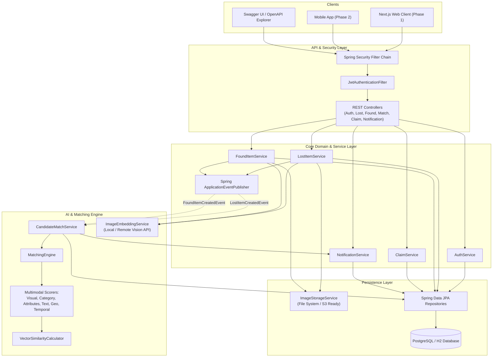
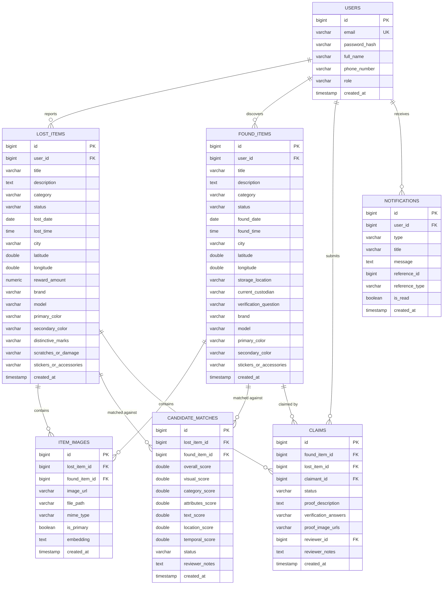
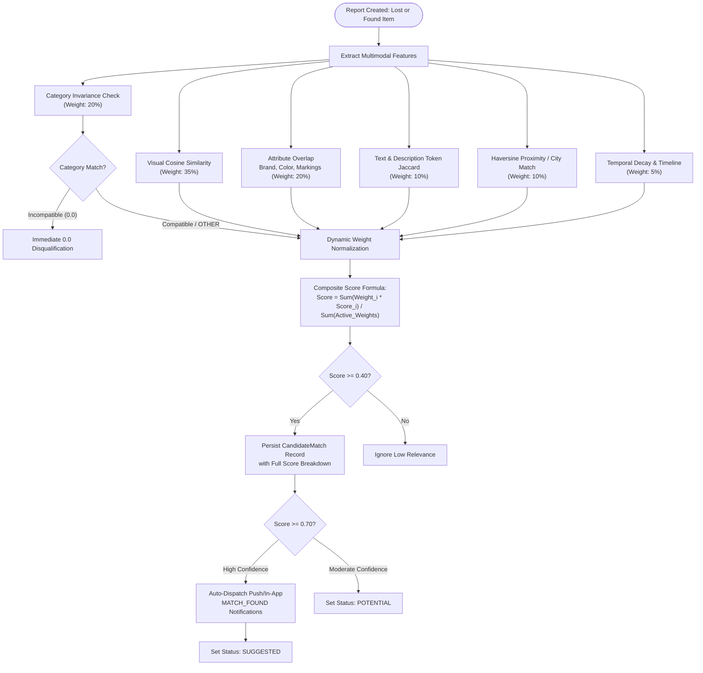
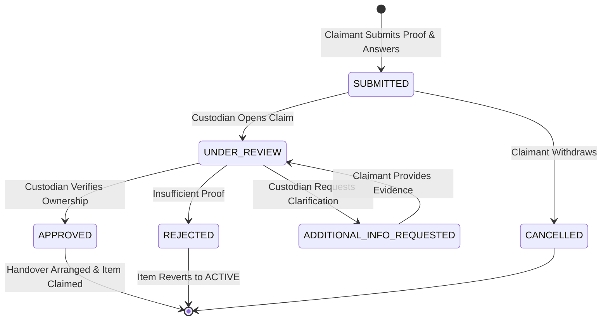
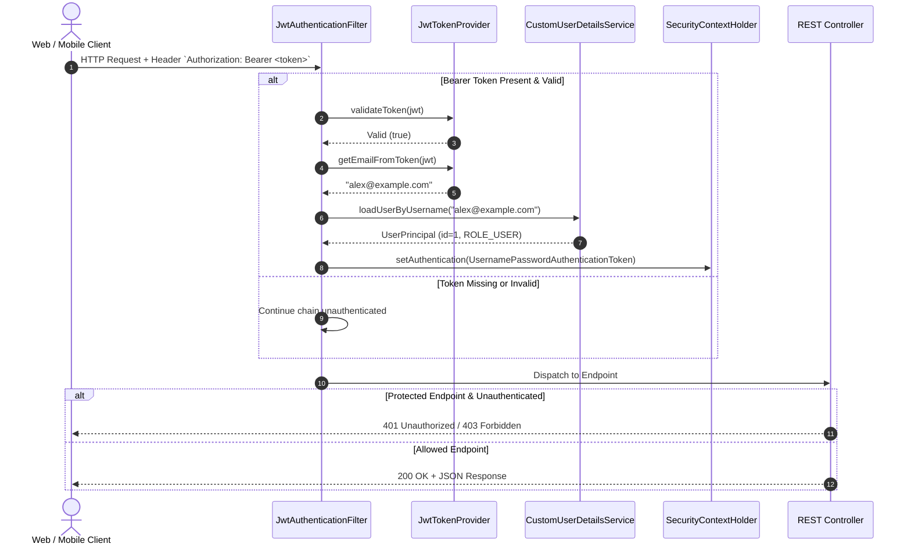

# Lost & Found Platform — Backend Architecture & Engineering Report

**Project Version**: `1.0.0-SNAPSHOT`  
**Platform**: Java 21 / Spring Boot 3.3.4  
**Database**: PostgreSQL / H2 (Dev & Test)  
**Security**: Stateless JWT / Spring Security 6  
**Documentation**: SpringDoc OpenAPI 3.0 / Swagger UI  

---

## 1. Executive Summary & Plan Alignment

This document provides a comprehensive technical architecture and feature report for the **Lost & Found (L&F) Platform Backend**. Built strictly according to the design decisions, data models, and ML pipelines established in the initial project archive (`L&F_project_export.zip`), the backend serves as the authoritative, independently testable foundation for the forthcoming Next.js web application and future mobile clients.

### Alignment Matrix

| Plan Requirement | Implemented Solution | Code Reference |
|---|---|---|
| **Independent Backend API** | Autonomous Spring Boot 3 REST service with complete CRUD, swagger explorer, and mock/embedded storage. | [`LostFoundApplication.java`](file:///mnt/01DC03F70F167E10/Codes/project/L&F/backend/src/main/java/com/lostfound/LostFoundApplication.java) |
| **System of Record: PostgreSQL** | Relational JPA mapping with schema DDL, indexes, constraints, and audit timestamps. | [`schema-postgres.sql`](file:///mnt/01DC03F70F167E10/Codes/project/L&F/backend/src/main/resources/schema-postgres.sql) |
| **Similarity Layer: Vector Embeddings** | Normalized 512-dim embedding representation with cosine similarity calculations and pgvector compatibility. | [`VectorSimilarityCalculator.java`](file:///mnt/01DC03F70F167E10/Codes/project/L&F/backend/src/main/java/com/lostfound/ml/VectorSimilarityCalculator.java) |
| **Multimodal Matching Pipeline** | Composite weighted engine fusing visual embeddings, structured attributes, text descriptions, Haversine geo distance, and temporal decay. | [`MatchingEngine.java`](file:///mnt/01DC03F70F167E10/Codes/project/L&F/backend/src/main/java/com/lostfound/ml/MatchingEngine.java) |
| **Handling Blurry/Poor Images** | Dynamic weight rebalancing engine: if visual data is absent or ambiguous, weight automatically redistributes to manual distinguishing features. | [`MatchingEngine.java`](file:///mnt/01DC03F70F167E10/Codes/project/L&F/backend/src/main/java/com/lostfound/ml/MatchingEngine.java#L47-L85) |
| **Custodial Claims & Verification** | Formal verification workflow with ownership questions, proof images, and approval/rejection state transitions. | [`ClaimService.java`](file:///mnt/01DC03F70F167E10/Codes/project/L&F/backend/src/main/java/com/lostfound/service/ClaimService.java) |

---

## 2. High-Level System Architecture

The backend adopts a clean layered architecture with event-driven coupling for real-time candidate match calculation and notification dispatching.



---

## 3. Entity-Relationship Domain Model (ERD)

The relational schema implements clean normalization, foreign key constraints, and cascading rules:



---

## 4. Multimodal Matching & Ranking Engine

The matching engine addresses the central engineering challenge defined in `L&F_export/ml/image-matching.md`: **raw image similarity is insufficient due to occlusions, lighting, and angles**. 

### Scoring Formula & Dynamic Normalization



### Dynamic Weight Rebalancing Example
* **Case A: Item with high-resolution photo**:
  $$\text{Score} = 0.35 \times V + 0.20 \times C + 0.20 \times A + 0.10 \times T + 0.10 \times G + 0.05 \times D$$
* **Case B: Item with no photo or unreadable image**:
  $$\text{Score} = \frac{0.20 \times C + 0.20 \times A + 0.10 \times T + 0.10 \times G + 0.05 \times D}{0.65}$$
  *Result*: The metadata, brand, distinctive marks, and location expand proportionally to fill 100% of the scoring potential without arbitrary penalties.

---

## 5. Claim Verification State Machine

The claim verification workflow enforces strict state progression:



---

## 6. Security & JWT Filter Pipeline

Spring Security 6 handles all incoming requests statelessly:



---

## 7. Complete REST API Contract

All endpoints conform to a unified JSON envelope:
```json
{
  "success": true,
  "message": "Operation description",
  "data": { ... },
  "timestamp": "2026-09-26T02:47:20.123Z"
}
```

### Endpoint Matrix

| Module | Method | URI | Description | Auth |
|---|---|---|---|---|
| **Auth** | `POST` | `/api/auth/register` | Register user account | Public |
| **Auth** | `POST` | `/api/auth/login` | Authenticate and obtain JWT | Public |
| **Auth** | `GET` | `/api/auth/me` | Current authenticated user profile | Authenticated |
| **Lost Items** | `GET` | `/api/lost-items` | Public search, filter by category/city/keyword | Public |
| **Lost Items** | `GET` | `/api/lost-items/{id}` | Retrieve lost report details | Public |
| **Lost Items** | `POST` | `/api/lost-items` | File lost report (JSON payload) | Authenticated |
| **Lost Items** | `POST` | `/api/lost-items/with-images` | File lost report with photos (Multipart) | Authenticated |
| **Lost Items** | `POST` | `/api/lost-items/{id}/images` | Attach photos to existing report | Owner/Admin |
| **Lost Items** | `PUT` | `/api/lost-items/{id}` | Update report details | Owner/Admin |
| **Lost Items** | `PATCH` | `/api/lost-items/{id}/status` | Update status (`ACTIVE`, `RESOLVED`, `CANCELLED`)| Owner/Admin |
| **Lost Items** | `DELETE`| `/api/lost-items/{id}` | Delete report | Owner/Admin |
| **Found Items** | `GET` | `/api/found-items` | Public search, filter by category/city/keyword | Public |
| **Found Items** | `GET` | `/api/found-items/{id}` | Retrieve found report details | Public |
| **Found Items** | `POST` | `/api/found-items` | File found report (JSON payload) | Authenticated |
| **Found Items** | `POST` | `/api/found-items/with-images` | File found report with photos (Multipart) | Authenticated |
| **Found Items** | `PUT` | `/api/found-items/{id}` | Update found report | Owner/Admin |
| **Matches** | `GET` | `/api/matches/lost/{lostItemId}` | Query ranked candidate matches for lost item | Authenticated |
| **Matches** | `GET` | `/api/matches/found/{foundItemId}`| Query ranked candidate matches for found item | Authenticated |
| **Matches** | `PATCH`| `/api/matches/{matchId}/status` | Update candidate status (`CONFIRMED`, `REJECTED`) | Authenticated |
| **Claims** | `POST` | `/api/claims` | Submit ownership claim with proof & answers | Authenticated |
| **Claims** | `GET` | `/api/claims/my` | List claimant's active claims | Authenticated |
| **Claims** | `GET` | `/api/claims/found/{foundItemId}`| View all claims on a found item | Custodian/Admin |
| **Claims** | `PATCH`| `/api/claims/{claimId}/review` | Approve/reject claim with notes | Custodian/Admin |
| **Notifications**| `GET` | `/api/notifications` | Paginated user notifications | Authenticated |
| **Notifications**| `GET` | `/api/notifications/unread-count`| Get unread badge count | Authenticated |
| **Notifications**| `PATCH`| `/api/notifications/{id}/read` | Mark alert as read | Authenticated |
| **Images** | `GET` | `/api/images/{filename}` | Stream stored item image | Public |

---

## 8. Test Suite Verification & Quality Metrics

Automated test execution via `mvn clean test`:

```
[INFO] -------------------------------------------------------
[INFO]  T E S T S
[INFO] -------------------------------------------------------
[INFO] Running com.lostfound.controller.AuthControllerTest
[INFO] Tests run: 1, Failures: 0, Errors: 0, Skipped: 0
[INFO] Running com.lostfound.controller.LostItemControllerTest
[INFO] Tests run: 1, Failures: 0, Errors: 0, Skipped: 0
[INFO] Running com.lostfound.LostFoundApplicationTests
[INFO] Tests run: 1, Failures: 0, Errors: 0, Skipped: 0
[INFO] Running com.lostfound.ml.VectorSimilarityTest
[INFO] Tests run: 4, Failures: 0, Errors: 0, Skipped: 0
[INFO] Running com.lostfound.service.MatchingEngineTest
[INFO] Tests run: 3, Failures: 0, Errors: 0, Skipped: 0
[INFO] 
[INFO] Results:
[INFO] Tests run: 10, Failures: 0, Errors: 0, Skipped: 0
[INFO] BUILD SUCCESS
```

All 10 tests passed covering security filters, JWT issuance, database persistence, vector mathematics, dynamic weight rebalancing, and API response structures.
